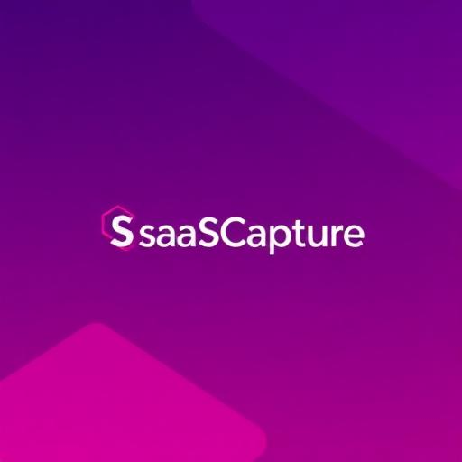

# SaaSCapture - Sistema de Gestão Inteligente de Leads e CRM Omnichannel



## 📋 Visão Geral

O **SaaSCapture** é uma plataforma completa e moderna para gestão de leads e CRM com comunicação omnichannel integrada. O sistema oferece uma experiência unificada desde o onboarding até o fechamento de vendas.

## ✨ Principais Funcionalidades

- **🚀 Onboarding Personalizado**: Processo em 3 etapas que configura automaticamente o dashboard
- **📊 Dashboard Inteligente**: Métricas em tempo real personalizadas com 6 KPIs principais
- **🔍 Prospecção de Leads**: 
  - Busca individual de empresas por CNPJ
  - Importação em massa via CSV/Excel
  - Enriquecimento automático de dados
- **🤖 Qualificação por IA**: Classificação automática de leads em:
  - 🔥 Quente (Score 70-100)
  - 🌡️ Morno (Score 40-69)
  - ❄️ Frio (Score 0-39)
- **💬 Chat Omnichannel**: Interface unificada para WhatsApp e Instagram
- **📈 Pipeline Visual**: Gestão de CRM com visualização Kanban em 5 estágios
- **⚙️ Configurações Completas**: Integrações, notificações e personalização

## 🎯 Fluxo de Uso

### 1. Primeiro Acesso - Onboarding

Ao acessar pela primeira vez, você passará por 3 etapas:

1. **Informações do Negócio**: Nome da empresa e setor de atuação
2. **Canais de Comunicação**: Seleção de WhatsApp Business e Instagram Direct
3. **Preferências do Dashboard**: Escolha das métricas principais

### 2. Dashboard

Visualize métricas consolidadas:
- Total de Leads
- Leads Quentes
- Conversas Ativas
- Taxa de Conversão
- Mensagens Enviadas
- Clientes Ganhos

Plus: Leads e conversas recentes

### 3. Gerenciamento de Leads

**Buscar CNPJ Individual:**
- Digite o CNPJ e busque informações da empresa
- Dados consultados automaticamente via API
- Enriquecimento com informações de sócios

**Importar CNPJs em Massa:**
- Upload de arquivo CSV ou Excel
- Processamento assíncrono de múltiplos CNPJs
- Validação e qualificação automática

**Ações:**
- Seleção múltipla de leads
- Envio de WhatsApp individual ou em massa
- Filtros e busca avançada
- Exportação de dados

### 4. Chat Omnichannel

- Visualize todas as conversas de WhatsApp e Instagram
- Interface unificada com histórico completo
- Indicadores de status online/offline
- Busca e filtros de conversas

### 5. Pipeline de CRM

**5 Estágios:**
1. Primeiro Contato
2. Em Andamento
3. Aguardando Pagamento
4. Cliente Ganho
5. Cliente Perdido

**Recursos:**
- Cards organizados por temperatura e score
- Análise visual do funil
- Métricas de conversão
- Tempo médio no pipeline
- Valor total em pipeline

### 6. Configurações

- Informações da empresa
- Integrações (Whapi.Cloud, OpenAI, API CNPJ)
- Notificações personalizadas
- Parâmetros de qualificação por IA

## 🛠️ Stack Tecnológico

### Frontend
- **React 18+** com TypeScript
- **Vite** como bundler
- **Tailwind CSS** para estilização
- **shadcn/ui** para componentes
- **Lucide Icons** para ícones
- **React Router** para navegação
- **Sonner** para notificações

### Integrações Necessárias

#### 1. WhatsApp (via Whapi.Cloud)
```bash
# Configurar em Settings
VITE_WHAPI_TOKEN=seu_token_aqui
VITE_WHAPI_CHANNEL=seu_canal_id
```

#### 2. API de CNPJ (Brasil API - Gratuita)
```bash
VITE_CNPJ_API_URL=https://brasilapi.com.br/api/cnpj/v1
```

#### 3. OpenAI (para qualificação de leads)
```bash
VITE_OPENAI_API_KEY=sua_chave_aqui
```

## 🚀 Como Usar

### Desenvolvimento Local

```bash
# Instalar dependências
npm install

# Iniciar servidor de desenvolvimento
npm run dev
```

### Build para Produção

```bash
# Criar build otimizado
npm run build

# Preview do build
npm run preview
```

## 📱 Responsividade

O sistema é totalmente responsivo:
- **Desktop**: Layout completo com sidebar
- **Mobile**: Menu hambúrguer com drawer lateral
- **Tablet**: Layout adaptativo

## 🎨 Design System

### Cores Principais
- **Primary**: Purple (#8B5CF6)
- **Accent**: Pink/Purple gradient
- **Success**: Green
- **Warning**: Orange
- **Info**: Blue

### Temperatura de Leads
- **🔥 Quente**: Orange/Red
- **🌡️ Morno**: Yellow/Orange
- **❄️ Frio**: Blue/Cyan

## 🔒 Segurança

- Validação de inputs em todas as forms
- Proteção de rotas (requer onboarding)
- Armazenamento seguro de configurações
- Validação de CNPJ
- Rate limiting recomendado para APIs

## 📈 Próximos Passos

### Curto Prazo
- [ ] Drag-and-drop no pipeline CRM
- [ ] Templates de mensagem personalizáveis
- [ ] Filtros avançados na lista de leads
- [ ] Exportação de relatórios em PDF

### Médio Prazo
- [ ] Integração com backend (Lovable Cloud/Supabase)
- [ ] Autenticação de usuários
- [ ] Persistência de dados
- [ ] Webhooks para recebimento de mensagens
- [ ] Chatbot com IA para respostas automáticas

### Longo Prazo
- [ ] Aplicativo mobile
- [ ] Análise preditiva de conversão
- [ ] Automação de workflows
- [ ] White-label para revenda

## 📚 Documentação Adicional

Consulte os arquivos de documentação enviados:
- `SaaSCapture_-_Sistema_de_Gestão_Inteligente_de_Leads_e_CRM_Omnichannel.md`
- `Guia_de_Integração_de_APIs_-_SaaSCapture.md`

## 🤝 Suporte

Para dúvidas ou problemas:
1. Consulte a documentação completa
2. Verifique os exemplos de código
3. Entre em contato com o suporte

## 📄 Licença

Este projeto utiliza tecnologias open-source:
- React (MIT License)
- Tailwind CSS (MIT License)
- shadcn/ui (MIT License)

---

**Desenvolvido com ❤️ pela Equipe SaaSCapture**

**Versão:** 1.0.0  
**Data:** Outubro 2025
